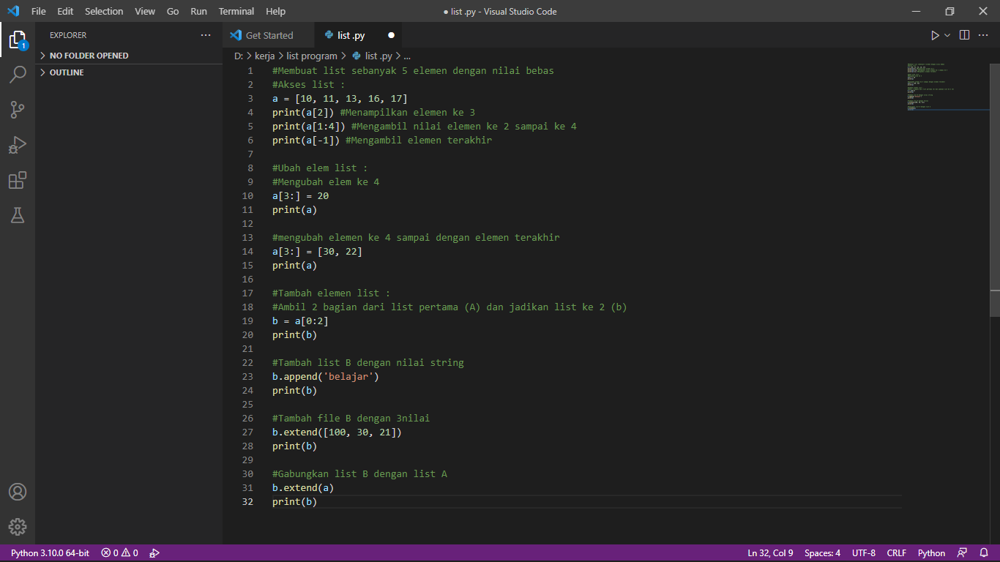

                                        # LATIHAN MEMBUAT LIST 
Membuat List Python 

List adalah tipe data yang paling serbaguna yang tersedia dalam bahasa Python, yang dapat ditulis sebagai daftar nilai yang dipisahkan koma (item) antara tanda kurung siku. Hal penting tentang daftar adalah item dalam list tidak boleh sama jenisnya.

Membuat list sangat sederhana, tinggal memasukkan berbagai nilai yang dipisahkan koma di antara tanda kurung siku. Dibawah ini adalah contoh sederhana pembuatan list dalam bahasa Python.

Akses list:

• tampilkan elemen ke 3 

• ambil nilai elemen ke 2 sampai elemen ke 4 

• ambil elemen terakhir 

Ubah elemen list:

• ubah elemen ke 4 dengan nilai lainnya

• ubah elemen ke 4 sampai dengan elemen terakhir

Tambah elemen list: 

• ambil 2 bagian dari list pertama (A) dan jadikan list ke 2 (B)

• tambah list B dengan nilai string

• tambah list B dengan 3 nilai

• gabungkan list B dengan list A

Contoh sederhana pembuatan list dalam bahasa Python.

 

                                SEKIAN DARI SAYA SEMOGA BERMANFAAT
                                            TERIMA KASIH 